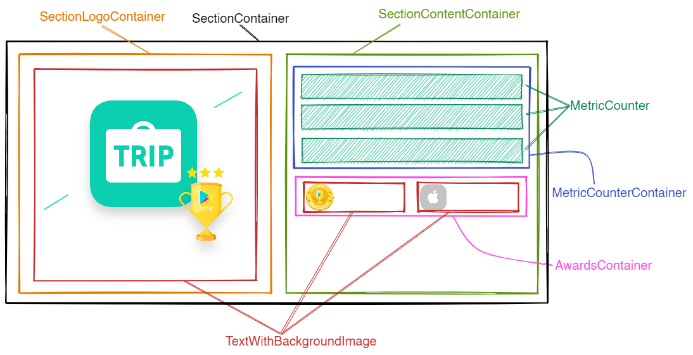
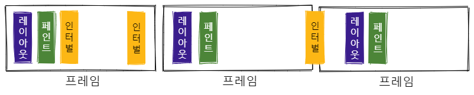
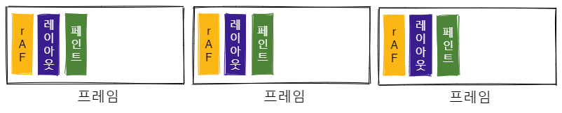
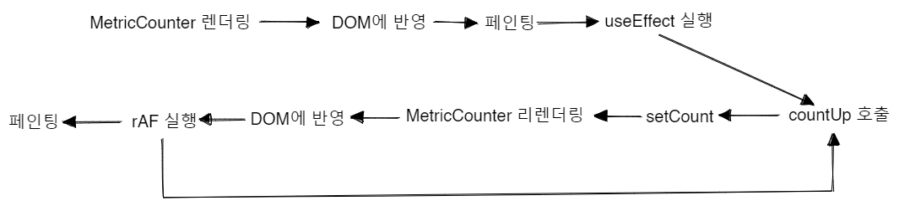

# 트리플 사전과제

## 실행 방법

```
npm i
npm start
```

## 사용 기술 스택

### Babel과 Webpack

- 바벨의 경우 리액트에서 사용하는 JSX를 변환하기 위해 사용하였습니다.
- 웹팩의 경우 일반적으론 여러 파일의 의존성을 분석해서 여러 최적화 작업을 수행하고 파일을 번들링 하기 위해 사용되지만, 이 프로젝트에선 주로 웹팩 dev server에서 제공하는 HMR 기능을 사용하여 개발하기 위해 사용했습니다.

### ESLint와 Prettier

- 코드의 스타일을 일관되게 유지하고, 에러나 안티 패턴을 찾기 위해 사용하였습니다. [eslint-config-triple](https://github.com/titicacadev/eslint-config-triple)을 참고하여 설정하였습니다.

### styled-components

styled-components를 사용한 이유는 아래와 같습니다:

- 스타일을 적용할 때 styled-components를 통해 스타일이 결합된 컴포넌트를 생성함으로써 className 중복문제를 해결할 수 있어 좋다고 생각합니다.
- 스타일을 변경할 때도 className을 기반으로 하는 경우 스타일을 변경했을 때 다른 컴포넌트에도 영향을 미치는지 파악해야 하지만, styled-components를 사용하는 경우 이러한 문제가 없어 편하다고 생각합니다.
- prop을 넘겨받아 런타임에 변경되는 상태에 따른 스타일을 동적으로 변경하기 수월하다고 생각합니다.

## 동작 화면


## 고민과 해결

### 디렉토리 설계

디렉토리를 설계할 땐 비슷한 관심사를 가진것끼리 최대한 가까이 존재할 수 있도록 했습니다. 예를 들어 `src/style`에는 앱 전체에서 사용되는 글로벌 스타일 파일과 여러 컴포넌트에서 공유하는 애니메이션 관련 파일을 위치시켰습니다.

또한 숫자가 올라가는 애니메이션을 구현하는데 사용된 커스텀 훅, 타입, 유틸 함수 디렉토리는 오직 `MetricCounter` 컴포넌트에서만 사용되므로 `src` 디렉토리의 하위에 위치시키지 않고, `MetricCounter`가 존재하는 `src/components/metric-counter` 디렉토리의 하위에 위치하도록 하여 `MetricCounter` 컴포넌트와 최대한 가깝게 위치할 수 있도록 하였습니다.

이렇게 비슷한 관심사를 가진 요소들을 서로 가깝게 위치시킴으로써 이후 변경 사항이 발생했을 때 디렉토리를 이리저리 찾아다닐 필요 없이 비교적 쉽게 변경 사항을 반영할 수 있다고 생각합니다.

### 컴포넌트 설계

우선, 프론트엔드에서 컴포넌트는 아래의 역할을 수행한다고 생각합니다:

1. (API등을 이용해서) 외부로부터 주입받은 데이터 및 컴포넌트 내부의 상태를 관리하고, 이러한 데이터를 UI로 표현.
2. 사용자와의 인터렉션을 통해 데이터를 조작.

따라서 컴포넌트를 설계할 땐 데이터를 중심으로, 각 컴포넌트가 하나의 역할만을 수행하도록 설계하려고 노력합니다.



- `TextWithBackgroundImage`: 각종 이미지와 텍스트가 같이 존재하는 UI의 경우, 이미지 크기와 텍스트 위치를 외부에서 prop으로 넘겨받도록 설계하면 이미지 크기 혹은 텍스트 위치별 컴포넌트를 각각 만들지 않고 재사용할 수 있을 것 같아 이렇게 설계하였습니다.
  - 이때 트리플의 로고, 구글 플레이 로고, 애플 로고를 띄울 때 HTML의 `` 태그와 CSS의 `background-image: url(...)` 중 어떤 것을 사용할 것인가에 대해 고민했었는데, 아래 글들을 참고하여 CSS를 통해 이미지를 띄우기로 했습니다:
	  - [\ vs background-image :: 마이구미 :: 마이구미의 HelloWorld](https://mygumi.tistory.com/369)
    - [html - When to use IMG vs. CSS background-image? - Stack Overflow](https://stackoverflow.com/questions/492809/when-to-use-img-vs-css-background-image)
  - 즉, **사용자가 컨텐츠를 이해하는 데 해당 이미지가 도움을 주는가?** 혹은 **이미지가 핵심 컨텐츠인가?** 를 고려해봤을 때, 핵심 컨텐츠는 `2019년 2월 기준`, `2018 구글 플레이스토어 올해의 앱 최우수상 수상`과 같은 텍스트라고 생각했고, 로고 이미지들은 없어도 사용자가 컨텐츠를 이해하는데 크게 지장을 주지 않는 요소라고 판단하였습니다. 따라서 이미지를 표시할 때 HTML의 `` 태그 대신 CSS의 `background-image` 속성을 사용하였습니다.
- `MetricCounter`: 숫자 데이터를 나타내는 컴포넌트로, 숫자가 올라가는 기능과 증가 속도가 느려지는 기능은 `useCountUp`이라는 커스텀 훅에 위임하고, 사용자로부터 시작 값, 종료 값, 애니메이션 지속 시간, 애니메이션 함수를 넘겨받도록 인터페이스를 구성하였습니다.
- 이외에 섹션과 관련된 컨테이너 및 수상 내역을 나타내는 컨테이너는 레이아웃을 구성하기 위해 사용하였습니다.

### 숫자 증가 애니메이션 구현

#### 해결책 구상

- 증가 속도가 느려지는 효과를 구현하기 위해 CSS 애니메이션에서 사용되는 `ease out` 함수를 사용할 수 있으리라 생각했고, 처음엔 이를 이용하여 값을 1씩 증가시키면서 함수의 실행 속도(호출 횟수)를 조절하여 구현하고자 했습니다.
- 하지만 이렇게 하니 서로 다른 크기의 값을 같은 시간 안에 증가시킬 수 없었습니다. 예를 들어 값을 0에서 350까지 증가시키는 경우와 0에서 21까지 증가시키는 경우를 동시에 수행할 때, 값을 1씩 증가시키는 방법으로는 도저히 동시에 끝나도록 할 수 없었습니다.
- 이에 생각을 바꿔 값을 1씩 증가시키면서 함수의 실행 속도를 조절하기보다, 함수는 일정 속도로 실행되도록 하고 값을 증가할 때 증가하는 크기를 조절하는 방식으로 문제를 해결했습니다. 예를 들어 0에서 350까지 증가시킬 땐 처음에 10씩 증가시키다가 9, 8, 7, ... 과 같이 줄여나가고, 0에서 21까지 증가시킬 땐 0.5, 0.4, 0.3, ... 과 같이 줄여나가는 방식을 사용했습니다.
- `ease out` 함수를 구현할 때 참고한 사이트는 아래와 같습니다:
  - [Easing Functions Cheat Sheet](https://easings.net/)

#### 구현

- 함수를 일정 속도로 실행하는 것을 구현하기 위해, `setInterval`(혹은 `setTimeout`), `requestAnimationFrame` 함수 중 `requestAnimationFrame` (이하 `rAF`라고 하겠습니다)를 사용하기로 했습니다.
- 사용자가 보기에 매끄러운 애니메이션 효과를 구현하려면 각 프레임마다 애니메이션 처리를 해줘야하는데, 이를 위해 `setInterval`을 사용하는 경우 부드러운 애니메이션을 구현하기 위해 `setInterval(callback, 1000 / 60)`과 같이 초당 60프레임에 맞춰 `callback`을 실행하는 경우가 일반적입니다. 하지만 브라우저 이벤트 루프의 동작을 생각해봤을 때, `setInterval`은 프레임을 전혀 고려하지 않기 때문에 아래 그림처럼 한 프레임에 `callback`이 두 번 실행될 수도 있고, 프레임 사이에 실행될 수도 있으며, 어떤 프레임에서는 아예 실행되지 않을 수도 있습니다:

  

- 하지만 `rAF`의 경우 화면의 각 프레임별 스타일 계산, 레이아웃, 페인팅 작업을 수행하기 직전에 동기적으로 실행되므로 프레임 누락 없이 매 프레임마다 애니메이션 처리를 해줄 수 있어 매끄러운 애니메이션을 구현하기에 적합하다고 생각합니다:

  

- 따라서 `rAF`를 사용하여 값을 증가시키는 `countUp` 함수를 매 프레임마다 호출하도록 하였고, `easeOut` 함수로 계산한 값을 `setCount`를 통해 업데이트 함으로써 숫자가 올라가는 애니메이션을 구현하였습니다. 이러한 과정들을 아래 그림과 같이 나타낼 수 있을 것 같습니다:

  
